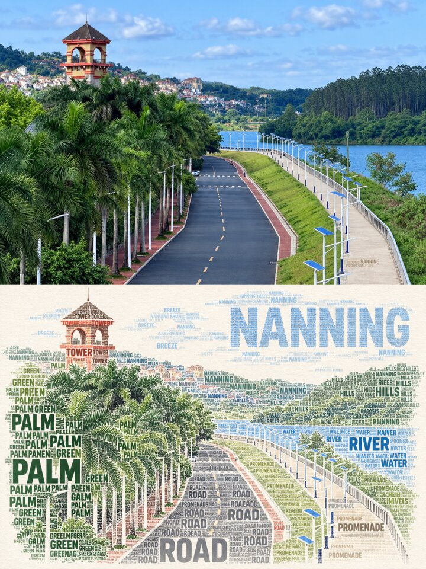
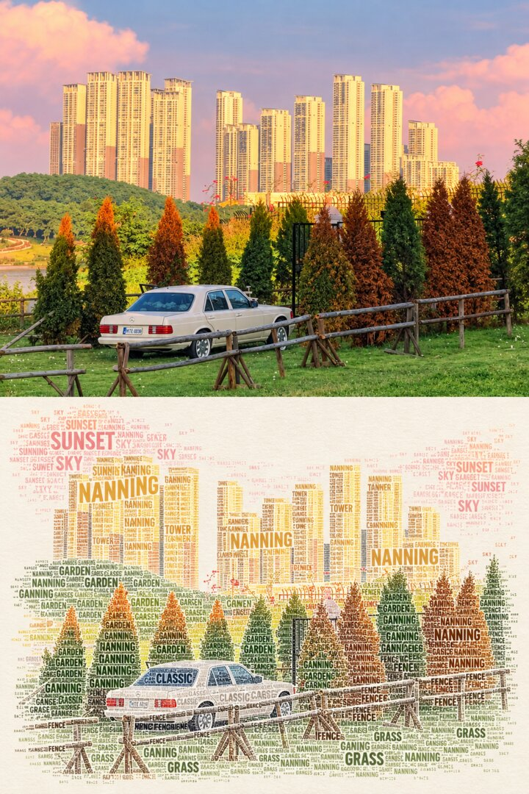

# LXX City Calligram Skill

A reusable Codex skill for transforming city photographs into premium editorial calligram posters.

The workflow creates a 3:4 two-panel composition:

- The upper panel retains the original photograph and its landmark-defining details.
- The lower panel reconstructs the main subject with English typography, led by the confirmed city name.

It also includes a city cultural-product mode for magnets, stationery, colorful DIY kits, souvenir objects, and food-themed visual concepts.

## Examples

| Riverside tower | Classic car and skyline |
| --- | --- |
|  |  |

## Install

Clone this repository, then place the repository folder in your Codex skills directory:

```text
~/.codex/skills/lxx-city-calligram-skill
```

Start a new Codex session, then invoke it with:

```text
$lxx-city-calligram-skill
```

## Example request

```text
用 $lxx-city-calligram-skill 把这张南宁城市照片做成字形海报：上半保留原照片，下半用高频 NANNING 与画面相关英文单词重建主体。
```

## What it preserves

- Confirmed city name and correct English spelling
- Landmark, vehicle, architecture, people, and other source-defining details in the upper photograph
- Typography that follows the real subject silhouette rather than using generic travel graphics

## License

MIT. See [LICENSE](LICENSE).
